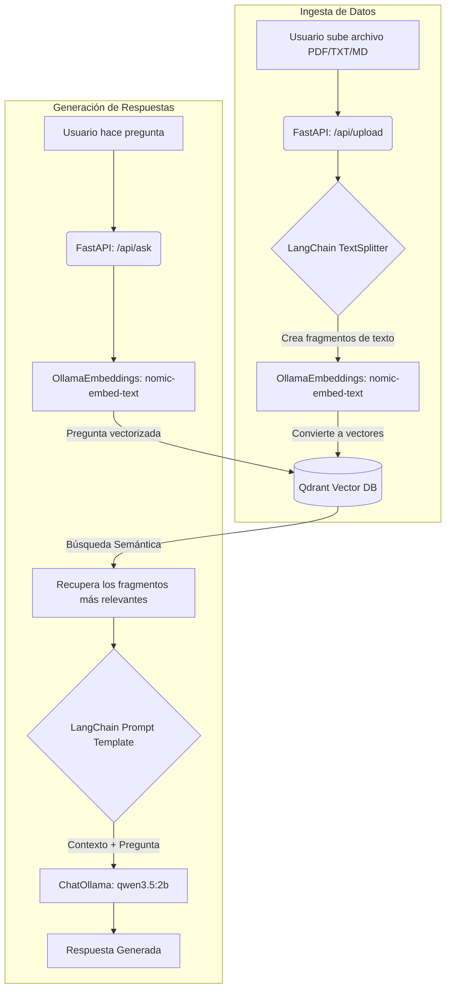

# Documentación del Proyecto RAG Local

Este proyecto implementa un sistema **RAG (Retrieval-Augmented Generation)** 100% local. Utiliza **FastAPI** para la API, **Qdrant** como base de datos vectorial para búsqueda semántica, y **Ollama** para ejecutar modelos de lenguaje (LLM) y generar embeddings (representaciones matemáticas del texto) directamente en tu computadora, sin depender de servicios externos ni comprometer la privacidad de los datos.

---

## Arquitectura del Sistema

El flujo del proyecto se divide en dos grandes fases: **Ingesta de datos** (subir archivos) y **Generación de respuestas** (hacer preguntas).

---

## Conceptos Clave para Estudiar

Para entender cómo funciona este proyecto en profundidad, es importante dominar estos cuatro conceptos:

### 1. RAG (Retrieval-Augmented Generation)
Los Modelos de Lenguaje (LLMs) saben mucho sobre el mundo en general, pero no saben nada sobre *tus datos privados* o documentos recientes. RAG soluciona esto en dos pasos:
1. **Recuperación (Retrieval):** Busca en tus documentos la información relevante a la pregunta.
2. **Generación (Generation):** Le pasa esa información al modelo de lenguaje como contexto extra para que pueda responder basándose en tus datos.

### 2. Embeddings (Vectorización)
Los modelos de IA no entienden el texto como palabras, sino como números. Un **Embedding** es la conversión de un texto a una lista de números (un vector) que captura su **significado semántico**.
* En este proyecto usamos el modelo `nomic-embed-text` a través de Ollama. Este modelo toma oraciones y las convierte en vectores de 768 dimensiones.
* Si dos frases significan lo mismo (ej. "El gato bebe leche" y "El felino toma lácteos"), sus vectores estarán matemáticamente "cerca" en el espacio, aunque no compartan casi ninguna palabra.

### 3. Base de Datos Vectorial (Qdrant)
Las bases de datos tradicionales (como SQL) buscan coincidencias exactas de palabras. Las bases de datos vectoriales almacenan los "Embeddings" y permiten hacer **búsqueda por similitud semántica**.
* Cuando haces una pregunta, esta se convierte en un vector.
* Qdrant compara la "distancia matemática" (Distancia Coseno) entre el vector de tu pregunta y los vectores de todos los fragmentos de tus documentos.
* Devuelve los fragmentos cuyo significado sea más cercano a tu pregunta.

### 4. Fragmentación (Chunking)
No podemos pasarle un libro entero de 500 páginas al LLM de una vez por las limitaciones de contexto. Por eso, durante la ingesta, cortamos los documentos en pedazos más pequeños ("chunks") usando el `RecursiveCharacterTextSplitter`. En este proyecto, cortamos en bloques de 1000 caracteres, dejando un solapamiento (overlap) de 200 caracteres entre fragmentos para no perder el contexto si cortamos justo a la mitad de una idea.

---

## Estructura del Código

La lógica del proyecto vive dentro de la carpeta `backend/`. Esta es su estructura arquitectónica:

* `main.py`: El punto de entrada de la aplicación. Configura FastAPI, los CORS y llama a la inicialización de Qdrant.
* `config.py`: Maneja todas las variables de entorno (URL de Ollama, URL de Qdrant). Si estás en Docker, lee de ahí; si estás local, asume `localhost`.
* **`api/`**
  * `routes.py`: Define los "endpoints" (URLs de la API). Contiene `/api/upload` (para guardar y procesar archivos) y `/api/ask` (para ejecutar la cadena RAG midiendo tiempo y tokens).
* **`schemas/`**
  * `rag.py`: Define usando Pydantic qué estructura deben tener los datos de entrada (`QueryRequest`) y de salida (`QueryResponse`).
* **`services/`**
  * `vector_db.py`: Gestiona la conexión con Qdrant. Tiene la función `process_file` que lee un PDF/TXT, lo fragmenta y lo guarda en la base de datos.
  * `llm.py`: Configura la conexión con Ollama. Aquí definimos el modelo de chat (`qwen3.5:2b`) y el modelo de embeddings (`nomic-embed-text`).
  * `rag_chain.py`: **El corazón del RAG**. Utiliza LangChain (LCEL) para armar el pipeline que une al recuperador de Qdrant, la plantilla del prompt, y el modelo de lenguaje de Ollama.

---

## Cómo Fluye la Información paso a paso

### A. Subiendo un documento
1. Mandas un POST a `/api/upload` con el archivo.
2. FastAPI guarda el archivo temporalmente.
3. Se llama a `process_file`: LangChain detecta si es PDF o texto, extrae todo el contenido.
4. Se corta el texto largo en pedazos manejables de 1000 caracteres.
5. Qdrant toma cada pedazo, le pide a Ollama (`nomic-embed-text`) su representación matemática, y lo guarda permanentemente en disco (dentro del contenedor de Docker).

### B. Haciendo una pregunta
1. Mandas un POST a `/api/ask` con el JSON `{"input": "Tu pregunta"}`.
2. La petición entra a `rag_chain.invoke()`.
3. LangChain toma tu pregunta y la pasa por el `retriever` (Qdrant).
4. Qdrant convierte tu pregunta en un vector y busca los fragmentos más parecidos que guardamos antes.
5. Los fragmentos recuperados se unen en un solo gran texto de "Contexto".
6. Se arma un Mensaje combinando el Contexto recuperado y tu Pregunta original, utilizando una plantilla estructurada.
7. Ese Mensaje estructurado se envía a Ollama (`ChatOllama: qwen3.5:2b`).
8. Ollama lee el contexto, entiende la pregunta, y genera una respuesta coherente, token por token.
9. FastAPI detiene el cronómetro, suma los tokens usados según la metadata de Ollama, y te responde el JSON con la respuesta final, tiempo, y tokens consumidos.
