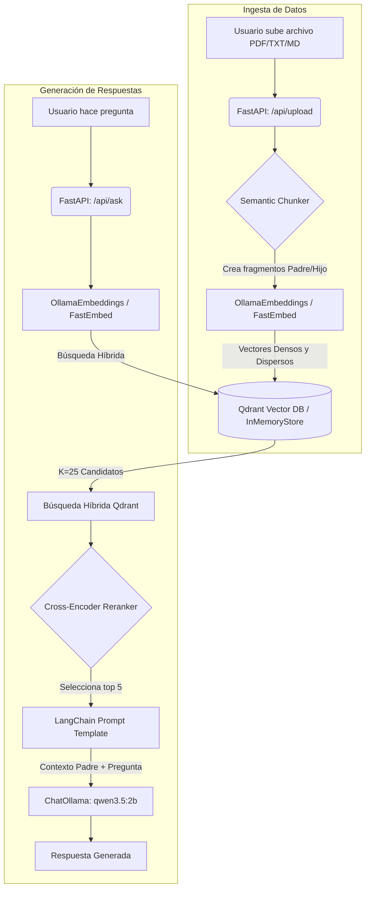

# Documentación del Proyecto RAG Local

Este proyecto implementa un sistema **RAG (Retrieval-Augmented Generation)** 100% local. Utiliza **FastAPI** para la API, **Qdrant** como base de datos vectorial para búsqueda semántica, y **Ollama** para ejecutar modelos de lenguaje (LLM) y generar embeddings (representaciones matemáticas del texto) directamente en tu computadora, sin depender de servicios externos ni comprometer la privacidad de los datos.

---

## Arquitectura del Sistema

El flujo del proyecto se divide en dos grandes fases: **Ingesta de datos** (subir archivos) y **Generación de respuestas** (hacer preguntas).

---

## Conceptos Clave para Estudiar

Para entender cómo funciona este proyecto en profundidad, es importante dominar estos cuatro conceptos:

### 1. RAG (Retrieval-Augmented Generation)
Los Modelos de Lenguaje (LLMs) saben mucho sobre el mundo en general, pero no saben nada sobre *tus datos privados* o documentos recientes. RAG soluciona esto en dos pasos:
1. **Recuperación (Retrieval):** Busca en tus documentos la información relevante a la pregunta.
2. **Generación (Generation):** Le pasa esa información al modelo de lenguaje como contexto extra para que pueda responder basándose en tus datos.

### 2. Embeddings (Vectorización)
Los modelos de IA no entienden el texto como palabras, sino como números. Un **Embedding** es la conversión de un texto a una lista de números (un vector) que captura su **significado semántico**.
* En este proyecto usamos el modelo `nomic-embed-text` a través de Ollama. Este modelo toma oraciones y las convierte en vectores de 768 dimensiones.
* Si dos frases significan lo mismo (ej. "El gato bebe leche" y "El felino toma lácteos"), sus vectores estarán matemáticamente "cerca" en el espacio, aunque no compartan casi ninguna palabra.

### 3. Base de Datos Vectorial (Qdrant)
Las bases de datos tradicionales (como SQL) buscan coincidencias exactas de palabras. Las bases de datos vectoriales almacenan los "Embeddings" y permiten hacer **búsqueda por similitud semántica**.
* Cuando haces una pregunta, esta se convierte en un vector.
* Qdrant compara la "distancia matemática" (Distancia Coseno) entre el vector de tu pregunta y los vectores de todos los fragmentos de tus documentos.
* Devuelve los fragmentos cuyo significado sea más cercano a tu pregunta.

### 4. Búsqueda Híbrida, Chunking Avanzado y Reranking
Para evitar el ruido y traer los mejores resultados, implementamos técnicas de grado producción:
* **Búsqueda Híbrida:** Combina búsqueda vectorial (semántica) con búsqueda por palabras clave exactas (Sparse Vectors / BM25).
* **Chunking Semántico & Parent-Child Retriever:** Corta el texto por significado en lugar de caracteres planos. Almacena oraciones chicas para buscar con precisión, pero le da al LLM el párrafo entero para máximo contexto.
* **Reranking:** Recupera 25 fragmentos iniciales y usa un modelo especializado (Cross-Encoder) para re-ordenarlos y quedarse solo con los 5 más valiosos.

---

## Estructura del Código

La lógica del proyecto vive dentro de la carpeta `backend/`. Esta es su estructura arquitectónica:

* `main.py`: El punto de entrada de la aplicación. Configura FastAPI, los CORS y llama a la inicialización de Qdrant.
* `config.py`: Maneja todas las variables de entorno (URL de Ollama, URL de Qdrant). Si estás en Docker, lee de ahí; si estás local, asume `localhost`.
* **`api/`**
  * `routes.py`: Define los "endpoints" (URLs de la API). Contiene `/api/upload` (para guardar y procesar archivos) y `/api/ask` (para ejecutar la cadena RAG midiendo tiempo y tokens).
* **`schemas/`**
  * `rag.py`: Define usando Pydantic qué estructura deben tener los datos de entrada (`QueryRequest`) y de salida (`QueryResponse`).
* **`services/`**
  * `vector_db.py`: Gestiona la conexión con Qdrant. Implementa el Semantic Chunker, Parent-Child Retriever y la Búsqueda Híbrida.
  * `llm.py`: Configura la conexión con Ollama para LLM y Embeddings.
  * `rag_chain.py`: **El corazón del RAG**. Utiliza LangChain para armar el pipeline con el CompressionRetriever (Reranker) antes de enviarle todo al modelo de lenguaje.

---

## Cómo Fluye la Información paso a paso

### A. Subiendo un documento
1. Mandas un POST a `/api/upload` con el archivo.
2. FastAPI guarda el archivo temporalmente.
3. LangChain lee el documento y el `ParentDocumentRetriever` usa `SemanticChunker` para dividirlo en fragmentos padres (con sentido completo) e hijos (trozos precisos).
4. Qdrant guarda los vectores densos (Ollama) y dispersos (FastEmbed) de los hijos, y la memoria guarda el texto de los padres.

### B. Haciendo una pregunta
1. Mandas un POST a `/api/ask` con la pregunta.
2. La pregunta pasa por el retriever híbrido, recuperando los 25 Hijos más relevantes (y trayendo sus Padres correspondientes).
3. Los 25 fragmentos Padre pasan por el `CrossEncoderReranker`, que los evalúa contra tu pregunta.
4. El Reranker filtra y deja solo los 5 contextos perfectos.
5. Se arma el Prompt con esos 5 contextos y la pregunta.
6. Ollama genera la respuesta final asegurando mínima alucinación gracias al contexto altamente filtrado.
